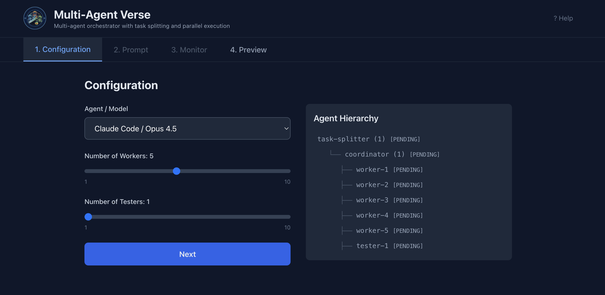
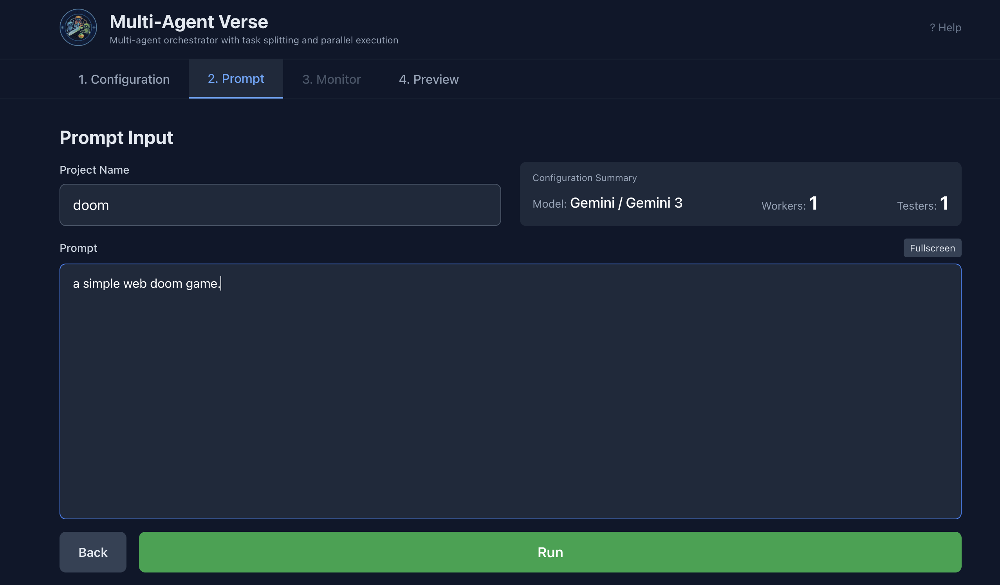
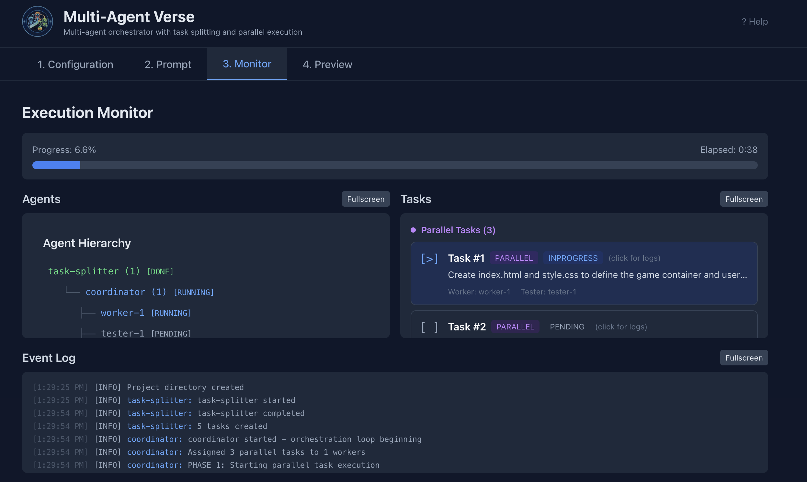
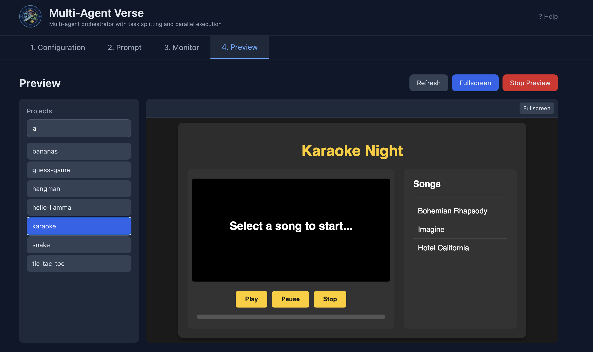

# Multi-Agent Verse


## What is Multi-Agent Verse

Multi-Agent Verse is a multi-agent orchestrator that coordinates multiple AI coding agents working in parallel. It takes a user prompt, splits it into parallelizable tasks, distributes them across worker agents, and validates results with tester agents. All agents run as local CLI subprocesses, not through APIs.

The system has a Rust backend (Actix-web/Tokio) and a TypeScript frontend (React 19/Vite/Tailwind CSS) with four tabs: Configuration, Prompt, Monitor, and Preview.

## Supported Models and Agents

| CLI Agent | Model | Command |
|-----------|-------|---------|
| claude-code | opus-4-5 | `claude -p <prompt> --model opus-4-5 --dangerously-skip-permissions` |
| codex | gpt-5.2 | `codex exec --full-auto --model gpt-5.2 <prompt>` |
| copilot | claude-sonnet-4 | `copilot --allow-all --model claude-sonnet-4 -p <prompt>` |
| gemini | gemini-3 | `gemini -y <prompt>` |
| llr3 | llama3 | `llr3 -p <prompt>` |

All five agent CLIs must be installed and available on PATH for their respective model to work. The llr3 agent runs Llama 3 locally via llama.cpp and automatically downloads the GGUF model (~4.7GB) to `~/llama/llama-3.gguf` on first run.

## Result

Configuration: Select the agent/model and set worker/tester counts. <br/>


Prompt: Enter project name and prompt. <br/>


Monitor: Real-time status of agents and tasks. <br/>


Preview: View generated project output. <br/>

 
## How It Works

### Agent Hierarchy

```
task-splitter (1)
    └── coordinator (1)
            ├── worker (N)
            └── tester (N)
```

- **task-splitter** - Receives the user prompt and breaks it into parallel and sequential tasks. Outputs JSON with `parallel_tasks` and `sequential_tasks` arrays. Ensures minimum 3 tasks (always includes run.sh and stop.sh as sequential tasks).
- **coordinator** - Orchestrates the entire workflow in 3 phases: (1) distribute and execute parallel tasks, (2) execute sequential tasks in order, (3) run testers. Must be the last agent to finish.
- **worker** - Executes one coding task at a time. Multiple instances run in parallel for parallel tasks. Count is user-defined (1-10).
- **tester** - Validates worker output through manual testing (file existence, run.sh works, port 5678 responds) and automated test generation. Count is user-defined (1-10).

### Workflow

1. User picks a model/agent and sets worker and tester counts in **Tab 1 (Configuration)**.
2. User enters a project name and prompt in **Tab 2 (Prompt)**. The prompt is automatically enriched with instructions to produce a `run.sh` that serves the app on port 5678 with `/index.html`.
3. Backend creates a session and spawns the orchestration pipeline:
   - task-splitter analyzes the prompt and outputs JSON with `parallel_tasks` and `sequential_tasks`
   - coordinator runs a 3-phase orchestration loop:
     - Phase 1: Distribute parallel tasks to workers and execute simultaneously
     - Phase 2: Execute sequential tasks one by one in order (run.sh, stop.sh)
     - Phase 3: Run testers to validate all completed tasks
   - workers execute tasks inside `solutions/{project_name}/code/`
   - testers perform manual verification and generate automated tests
4. **Tab 3 (Monitor)** shows real-time status with a split view: agent tree on the left, task list (grouped by parallel/sequential) on the right, event log at the bottom. Polls every 2 seconds.
5. **Tab 4 (Preview)** lists all completed projects from the `solutions/` folder. Clicking a project runs its `run.sh` and renders the output in an iframe.

### Solutions Directory

All generated code and logs are saved under `solutions/{project_name}/`:

```
solutions/{project_name}/
├── events.log
├── session.json
├── tasks.json
├── summary.json
├── code/
├── task-splitter/
├── coordinator/
├── worker-{1..N}/
└── tester-{1..N}/
```

### Running

```bash
./run.sh
```

This builds the Rust backend, installs frontend dependencies with bun, starts the backend on port 8080, and starts the frontend dev server on port 5173.

```bash
./stop.sh
```

Stops both backend and frontend processes.

## Limitations

- Each agent CLI (claude, codex, copilot, gemini, llr3) must be pre-installed and authenticated on the local machine. The system does not install or configure them.
- All agents share a single `solutions/{project_name}/code/` directory. Concurrent workers writing to the same files can produce conflicts.
- The task-splitter relies on the AI model to produce valid JSON with `parallel_tasks` and `sequential_tasks`. If parsing fails, fallback tasks are generated (parallel tasks based on worker count, plus run.sh and stop.sh as sequential).
- Agent execution has a 300-second timeout. Long-running tasks will be killed and marked as timeout.
- The coordinator does not re-assign failed tasks. If a worker or tester fails, the task stays in the failed state.
- Preview requires the generated project to have a working `run.sh` that serves on port 5678. Only one project can be previewed at a time.
- The backend session store is in-memory. Restarting the backend loses all active session state (persisted files in `solutions/` remain).
- No authentication or multi-user support. Designed for single-user local use.
- Gemini agent does not accept a model parameter. It always uses its default model.
- LLR3 runs Llama 3 locally on CPU. Inference is slower than cloud-based agents and output is limited to 512 tokens per call.
